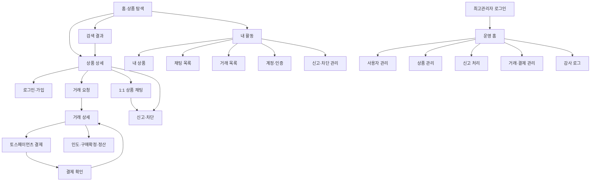

# 감자마켓 웹페이지 구성 설계

## 1. 문서 정보

- 상태: Draft
- 작성일: 2026-07-15
- 목적: 감자마켓 요구사항을 실제 웹 애플리케이션의 화면, 경로, 내비게이션,
  상태 및 상호작용 구조로 변환한다.
- 기능·보안 기준: `docs/requirements.md`
- 시각·상호작용 기준: `design.md`
- 우선순위: `P0`은 최초 출시 필수, `P1`은 출시 후 개선 화면이다.

요구사항과 디자인 문서가 충돌하면 제품 범위, 권한, 결제 및 보안은
`docs/requirements.md`를 우선하고 시각 표현과 컴포넌트 규칙은 `design.md`를
우선한다. 기존 `design.md`의 결제대행사 미결정 표현과 달리 이 문서는 최신
요구사항에 따라 토스페이먼츠 SDK v2 결제위젯 또는 호스팅 결제창을 사용한다.

## 2. 화면 설계 목표

1. 첫 화면부터 가까운 지역의 실제 상품을 탐색할 수 있어야 한다.
2. 상품 상세에서 채팅과 거래 요청까지 맥락이 끊기지 않아야 한다.
3. 거래 당사자는 현재 상태, 다음 행동, 7일 기한과 에스크로 보관 상태를 항상
   이해할 수 있어야 한다.
4. 차단, 신고, 정지, 숨김 상태는 UI와 서버 권한이 같은 결과를 보여야 한다.
5. 카드 정보는 감자마켓 UI가 수집하지 않고 토스페이먼츠 제공 화면에서만
   입력해야 한다.
6. 최고관리자 화면은 일반 사용자 화면과 분리하고 모든 고위험 행동에 사유,
   재인증 및 감사 기록을 요구해야 한다.

## 3. 사용자와 접근 수준

| 사용자 | 공개 화면 | 회원 화면 | 거래 화면 | 관리자 화면 |
| --- | --- | --- | --- | --- |
| 비회원 | 조회 가능 | 로그인 유도 | 접근 불가 | 접근 불가 |
| 인증대기 회원 | 조회 가능 | 인증 완료 화면만 쓰기 가능 | 접근 불가 | 접근 불가 |
| 활성 회원 | 조회 가능 | 전체 사용 | 전체 사용 | 접근 불가 |
| 이용정지 회원 | 정책상 읽기만 허용 | 쓰기 제한 안내 | 신규 행동 불가 | 접근 불가 |
| 탈퇴 회원 | 비회원과 동일 | 접근 불가 | 접근 불가 | 접근 불가 |
| 최고관리자 | 필요 시 사용 | 별도 운영 계정 사용 | 운영 조회만 | 전체 운영 기능 |

라우트 보호는 화면 숨김에만 의존하지 않는다. 인증, 역할, 객체 소유권, 차단
관계, 상품 상태 및 거래 상태를 서버가 매 요청마다 다시 검증한다.

## 4. 전체 정보 구조

공개 전체 채팅, 사용자 검색, 공개 사용자 프로필, 배송지 관리, 자유 송금,
경매 및 커뮤니티 피드는 현재 범위에 포함하지 않는다.

## 5. 공통 내비게이션

### 5.1 데스크톱 헤더

좌측부터 `감자마켓 로고`, `행정동 선택`, `통합 검색`을 배치한다. 우측에는
비회원일 때 `로그인`, `회원가입`을, 회원일 때 `판매하기`, `채팅`, `거래`,
`내 활동`을 제공한다. 읽지 않은 채팅과 처리할 거래는 아이콘과 숫자로 함께
표시한다.

- 헤더는 상품 탐색 화면에서 고정하되 콘텐츠를 가리지 않는다.
- 검색은 입력 중 레이아웃을 바꾸지 않고 검색 결과 화면으로 이동한다.
- 행정동 선택에는 정확한 주소나 좌표를 표시하지 않는다.
- 이용정지 회원에게 쓰기 버튼은 숨기지 않고 비활성 사유를 제공한다.

### 5.2 모바일 하단 내비게이션

`홈`, `검색`, `판매`, `채팅`, `내 활동`의 5개 항목으로 구성한다. `판매`는
더하기 아이콘과 접근 가능한 텍스트 레이블을 사용한다. 거래 목록은 `내 활동`
첫 화면과 채팅방의 상품 요약에서 빠르게 접근할 수 있게 한다.

### 5.3 최고관리자 내비게이션

일반 사용자 헤더와 분리된 운영 셸을 사용한다. 좌측 내비게이션은 `운영 홈`,
`사용자`, `상품`, `신고`, `거래·결제`, `감사 로그` 순서다. 상단에는 운영
환경, 마지막 로그인, 세션 만료, 재인증 상태를 표시한다.

### 5.4 전역 레이어

| 레이어 | 용도 | 규칙 |
| --- | --- | --- |
| 토스트 | 저장, 전송, 접수 완료 | 핵심 결과는 화면 본문에도 남긴다. |
| 확인 대화상자 | 차단, 취소, 환불, 탈퇴 | 영향과 되돌릴 수 있는지를 먼저 설명한다. |
| 바텀 시트 | 모바일 필터, 정렬 | 닫아도 입력 상태를 보존한다. |
| 전체 화면 단계 | 결제, 재인증 | 뒤로 가기와 중복 제출을 안전하게 제어한다. |
| 상태 배너 | 이용정지, 결제 점검, 미확정 거래 | 원인, 영향, 다음 확인 시각을 함께 표시한다. |

## 6. 페이지 목록

| ID | 경로 | 페이지 | 대상 | 우선순위 |
| --- | --- | --- | --- | --- |
| PUB-01 | `/` | 홈·가까운 상품 | 전체 | P0 |
| PUB-02 | `/search` | 상품 검색 결과 | 전체 | P0 |
| PUB-03 | `/products/:productId` | 상품 상세 | 전체 | P0 |
| AUTH-01 | `/login` | 로그인 | 비회원 | P0 |
| AUTH-02 | `/signup` | 회원가입·성인 확인 | 비회원 | P0 |
| AUTH-03 | `/verify` | 연락처 인증 | 인증대기 | P0 |
| AUTH-04 | `/password/reset` | 비밀번호 재설정 | 비회원·회원 | P0 |
| SELL-01 | `/products/new` | 상품 등록 | 활성 회원 | P0 |
| SELL-02 | `/products/:productId/edit` | 상품 수정 | 작성자 | P0 |
| SELL-03 | `/me/products` | 내 상품 관리 | 활성 회원 | P0 |
| CHAT-01 | `/chats` | 채팅 목록 | 활성 회원 | P0 |
| CHAT-02 | `/chats/:chatId` | 1:1 상품 채팅 | 참여자 | P0 |
| TRADE-01 | `/trades` | 거래 목록 | 활성 회원 | P0 |
| TRADE-02 | `/trades/:tradeId` | 거래 상세·상태 관리 | 거래 당사자 | P0 |
| PAY-01 | `/trades/:tradeId/checkout` | 에스크로 결제 | 구매자 | P0 |
| PAY-02 | `/payments/result` | 결제 결과 확인 | 구매자 | P0 |
| SAFE-01 | `/reports/new` | 신고 접수 | 활성 회원 | P0 |
| SAFE-02 | `/me/reports` | 내 신고 내역 | 활성 회원 | P0 |
| SAFE-03 | `/me/blocked-users` | 차단 사용자 관리 | 활성 회원 | P0 |
| ACCOUNT-01 | `/me` | 내 활동 홈 | 회원 | P0 |
| ACCOUNT-02 | `/me/account` | 계정·인증·세션 | 회원 | P0/P1 |
| ADMIN-01 | `/admin/login` | 최고관리자 로그인 | 최고관리자 | P0 |
| ADMIN-02 | `/admin` | 운영 홈 | 최고관리자 | P0/P1 |
| ADMIN-03 | `/admin/users` | 사용자 관리 | 최고관리자 | P0 |
| ADMIN-04 | `/admin/products` | 상품 관리 | 최고관리자 | P0 |
| ADMIN-05 | `/admin/reports` | 신고 처리 | 최고관리자 | P0 |
| ADMIN-06 | `/admin/trades` | 거래·결제 관리 | 최고관리자 | P0 |
| ADMIN-07 | `/admin/audit-logs` | 감사 로그 | 최고관리자 | P0 |
| SYS-01 | `/403`, `/404`, `/error` | 시스템 상태 화면 | 전체 | P0 |

## 7. 공개·탐색 페이지

### 7.1 PUB-01 홈·가까운 상품

**목적:** 선택한 행정동과 인접 행정동의 판매중 상품을 즉시 탐색한다.

**첫 화면 구성:** 상단 헤더 아래에 큰 브랜드 소개 대신 `현재 지역`, 검색창,
카테고리 바로가기, 최신 상품 그리드를 배치한다. `감자마켓` 이름은 헤더에서
명확히 보이되 첫 화면의 주 콘텐츠는 실제 상품이다.

**본문 구성:** `방금 올라온 상품`, `가격대별 보기`, `인접 동 상품`을
전체 폭 밴드로 구분한다. 각 상품 카드는 이미지, 판매 상태, 제목, 가격,
행정동, 등록 시각을 포함한다. 추천 알고리즘처럼 보이는 개인화 문구는 쓰지
않는다.

**상태:** 지역 미선택 시 행정동 선택을 먼저 제공한다. 상품 없음은 지역과
필터를 보여 주고 `검색 범위 다시 선택` 또는 회원에게 `상품 등록` 행동을
제공한다. 차단·숨김·삭제 상품은 카드 자체를 렌더링하지 않는다.

### 7.2 PUB-02 상품 검색 결과

**상단:** 검색어 입력, 결과 수, 현재 행정동, 필터 열기, 정렬 메뉴를 한 줄에
배치한다. 필터는 카테고리, 가격 범위, 행정동, 판매 상태를 제공한다.

**본문:** 데스크톱은 좌측 필터와 우측 상품 그리드, 모바일은 상단 필터 버튼과
바텀 시트를 사용한다. 적용된 조건은 제거 가능한 필터 칩으로 표시한다.

**상태:** 빈 검색어도 지역 내 전체 상품을 반환한다. 검색 오류, 결과 없음,
마지막 페이지를 구분한다. 페이지 이동이나 뒤로 가기 후에도 검색어, 필터,
정렬, 스크롤 위치를 복원한다.

### 7.3 PUB-03 상품 상세

**데스크톱:** 좌측 상품 갤러리, 우측 고정 정보 열로 구성한다. 정보 열에는
판매 상태, 제목, 가격, 행정동, 등록 시각, 판매자 식별용 최소 정보, `채팅하기`,
`거래 요청`을 둔다. 하단에는 설명과 카테고리를 배치한다.

**모바일:** 이미지, 가격·상태, 설명, 안전 정보 순으로 쌓고 하단에 현재 상태에
맞는 주 행동을 고정한다.

**권한과 상태:** 비회원의 행동은 로그인 후 원래 상품으로 돌아오게 한다.
본인 상품에는 `수정`, `상태 변경`, `삭제`를 제공하고 거래 요청은 숨긴다.
예약중·판매완료 상품은 신규 거래 요청을 막고 이유를 표시한다. 상품 및
판매자 신고는 더보기 메뉴에서 접근한다.

## 8. 인증·계정 페이지

### 8.1 AUTH-01 로그인

이메일 또는 휴대전화, 비밀번호, 로그인 버튼, 비밀번호 재설정, 회원가입
링크로 구성한다. 실패 이유로 계정 존재 여부를 과도하게 노출하지 않는다.
반복 실패 시 지연 또는 잠금 상태와 해제 방법을 안내한다.

### 8.2 AUTH-02 회원가입·성인 확인

한 화면의 긴 폼이 아니라 `연락처 입력`, `소유 인증`, `성인 확인`, `비밀번호
설정`, `완료` 단계로 구성한다. 각 단계는 현재 진행률과 이전 단계 이동을
제공한다. 미성년자 또는 성인 여부 미확인 사용자는 가입을 완료할 수 없으며
수집 목적과 실패 결과를 명확히 안내한다.

### 8.3 AUTH-03 연락처 인증

인증 코드 입력, 남은 시간, 재전송 대기 시간, 연락처 수정으로 구성한다.
인증 코드와 내부 오류는 화면·URL·분석 이벤트에 남기지 않는다.

### 8.4 AUTH-04 비밀번호 재설정

검증된 연락처 확인 후 새 비밀번호를 설정한다. 비밀번호 규칙은 입력 전에
보여 주고 충족 여부를 텍스트로 알린다. 완료 후 기존 세션 처리 결과와 로그인
이동을 안내한다.

### 8.5 ACCOUNT-01 내 활동 홈

`내 상품`, `채팅`, `거래`, `신고`, `차단 사용자`, `계정 설정`의 작업 중심
목록으로 구성한다. 처리할 거래와 읽지 않은 채팅을 상단에 보여 주되 카드형
대시보드를 과도하게 사용하지 않는다.

### 8.6 ACCOUNT-02 계정·인증·세션

연락처 인증 상태, 비밀번호 재설정, 회원 상태, 로그아웃, 회원 탈퇴를 제공한다.
P1에서는 활성 세션 목록과 개별 종료를 추가한다. 공개 자기소개나 사용자 검색은
현재 요구사항에 없으므로 제공하지 않는다.

## 9. 판매 페이지

### 9.1 SELL-01 상품 등록

**구성 순서:** 이미지 업로드, 제목, 설명, 가격, 카테고리, 행정동, 미리보기,
게시 버튼 순으로 둔다. 행정동보다 상세한 주소는 입력받지 않는다.

**검증:** 이미지 개수·형식·크기, 제목·설명 길이, 0 이상 정수 가격을 입력
시점과 제출 시점에 검증한다. 실패한 필드로 포커스를 이동하고 기존 입력을
보존한다.

**상태:** 업로드 진행률, 이미지 실패 재시도, 게시 중 중복 제출 방지, 게시
완료 후 상품 상세 이동을 제공한다. 임시저장은 P1로 분리한다.

### 9.2 SELL-02 상품 수정

등록 폼을 재사용하되 현재 판매·거래 상태를 상단에 표시한다. 결제 진행 중인
상품은 가격과 핵심 조건 입력을 잠그고 이유를 표시한다. 작성자가 아니거나
숨김·삭제 상태이면 객체 존재 정보를 불필요하게 노출하지 않는다.

### 9.3 SELL-03 내 상품 관리

`판매중`, `예약중`, `판매완료`, `숨김` 탭과 검색을 제공한다. 각 행에는 이미지,
제목, 가격, 상태, 최근 수정 시각, 수정, 상태 변경을 둔다. 상품 삭제는 영향과
활성 거래 여부를 확인한 뒤 수행한다.

## 10. 채팅 페이지

### 10.1 CHAT-01 채팅 목록

최근 메시지 순으로 상품 이미지, 상대 표시명, 상품 제목, 최근 메시지, 시각,
읽지 않은 수를 보여 준다. 차단한 상대의 기존 대화는 목록에서 숨기고 차단
해제 시 다시 표시한다.

### 10.2 CHAT-02 1:1 상품 채팅

상단에 상품 이미지, 제목, 가격, 판매 상태와 `상품 보기`, `거래 보기`를 고정한다.
본문은 날짜 구분과 발신자 구분이 있는 메시지 목록, 하단은 텍스트 입력과 전송
버튼으로 구성한다.

- 메시지 전송 중, 성공, 실패, 재시도를 구분한다.
- 상대 이용정지, 차단, 상품 삭제·숨김 상태에서는 입력을 비활성화하고 이유를
  제공한다.
- `신고`, `차단`은 대화 메뉴에서 접근하며 확인 후 즉시 현재 화면을 읽기 전용
  또는 목록 이동 상태로 전환한다.
- 공개 또는 다자간 전체 채팅은 제공하지 않는다.

## 11. 거래·결제 페이지

### 11.1 TRADE-01 거래 목록

`구매`, `판매` 탭과 거래 상태 필터를 제공한다. 각 행에는 상품, 상대, 고정
거래 금액, 현재 단계, 다음 행동, 관련 기한을 표시한다. 결제 실패와 결제 확인
중을 같은 상태로 표현하지 않는다.

### 11.2 TRADE-02 거래 상세·상태 관리

페이지 상단에는 `trade-status-timeline`, 중앙에는 상품·상대·거래 금액,
`escrow-summary`, 하단에는 상태 이력과 가능한 행동을 배치한다.

| 현재 상태 | 구매자 주 행동 | 판매자 주 행동 |
| --- | --- | --- |
| 요청 | 요청 취소 | 수락 또는 거절 |
| 판매자수락 | 에스크로 결제 | 결제 대기 |
| 결제완료 | 직거래 진행 | 직거래 진행 |
| 인도완료 | 구매확정 또는 분쟁 | 구매확정 대기 |
| 구매확정 | 환불 가능 기한 확인 | 정산 보류 확인 |
| 정산대기 | 환불·분쟁 상태 확인 | 정산 예정일 확인 |
| 정산완료 | 거래 내역 확인 | 정산 내역 확인 |

판매자의 인도 완료 후 자동 구매확정 예정일, 구매확정 후 환불 종료일과 정산
예정일을 절대 날짜·시각과 남은 기간으로 함께 표시한다. 취소, 환불, 분쟁이
접수되면 정산 중지 상태를 가장 먼저 보여 준다.

### 11.3 PAY-01 에스크로 결제

상단에는 상품, 판매자, 서버에서 고정된 주문번호와 결제 금액, 에스크로 흐름을
표시한다. 결제 영역은 토스페이먼츠 SDK v2 결제위젯 또는 호스팅 결제창만
사용한다. 감자마켓이 만든 카드번호, 유효기간, CVC/CVV 입력 필드는 존재하면
안 된다.

- 결제 버튼은 한 번만 활성화하고 처리 중 중복 입력을 막는다.
- 토스페이먼츠 UI 주변에 불필요한 제3자 스크립트와 분석 도구를 배치하지 않는다.
- 카드 원문을 URL, 폼 상태, 로그, 오류 추적, 세션 재생에 전달하지 않는다.
- 토스페이먼츠 장애 시 `결제 시스템 점검 중` 배너와 거래 상세 복귀를 제공한다.

### 11.4 PAY-02 결제 결과 확인

성공 URL 진입만으로 성공 화면을 보여 주지 않는다. 초기 상태는 `결제 확인 중`이며
서버가 주문번호, 금액, 소유자 및 토스페이먼츠 조회 결과를 검증한 뒤 다음 중
하나로 전환한다.

| 결과 | 화면 행동 |
| --- | --- |
| 승인 완료 | 영수 정보와 에스크로 보관 상태를 표시하고 거래 상세로 이동 |
| 처리 중·미확정 | 자동 새로고침 시각과 수동 다시 확인 제공, 재결제 금지 |
| 승인 실패 | 안전한 오류 문구와 거래 상세 또는 재시도 제공 |
| 위변조·불일치 | 결제 완료 처리 없이 일반 오류와 고객지원 경로 제공 |
| 중복 요청 | 최초 처리 결과를 표시 |

## 12. 신고·차단 페이지

### 12.1 SAFE-01 신고 접수

신고 대상 요약, 사유 선택, 상세 설명, 증빙 첨부가 허용될 경우 첨부 영역,
제출 전 확인으로 구성한다. 신고 대상은 사용자, 상품, 메시지 중 하나이며
내부 관리자 분류나 다른 신고자의 정보는 표시하지 않는다.

### 12.2 SAFE-02 내 신고 내역

접수, 검토중, 조치완료, 기각 상태와 접수 시각을 보여 준다. 처리 결과는
신고자에게 공개 가능한 범위만 제공하고 관리자 메모와 조사 증거는 숨긴다.

### 12.3 SAFE-03 차단 사용자 관리

차단한 사용자와 차단 시각, `차단 해제`를 제공한다. 차단 해제 시 다시 보이게
되는 기존 대화와 상품의 영향을 확인한다. 차단 목록에서도 정확한 연락처나
민감한 사용자 정보는 표시하지 않는다.

## 13. 최고관리자 페이지

### 13.1 ADMIN-01 최고관리자 로그인

일반 로그인과 다른 경로·레이아웃을 사용하고 공유 계정을 허용하지 않는다.
로그인 실패, 세션 만료, 고위험 작업 재인증을 구분한다. 관리자 존재 여부나
보안 정책의 내부 값을 오류 메시지로 노출하지 않는다.

### 13.2 ADMIN-02 운영 홈

P0에서는 신고 대기, 정산·결제 이상, 이용정지 사용자, 숨김 상품으로 바로
이동하는 작업 목록을 제공한다. P1에서는 신고 처리 시간, 거래 상태, 결제
장애와 대사 현황을 집계한다. 장식용 통계 카드보다 처리할 항목을 우선한다.

### 13.3 ADMIN-03 사용자 관리

식별자, 상태, 가입일로 검색하고 사용자 상세에서 인증 상태, 제재 이력, 상품,
신고, 거래 제한을 탭으로 제공한다. `경고`, `이용정지`, `활성 복구`, `거래 제한`
행동은 사유 입력과 재인증을 요구한다. 비밀번호, 인증 코드, 세션 토큰, 전체
연락처와 결제수단 원문은 표시하지 않는다.

### 13.4 ADMIN-04 상품 관리

제목, 작성자 식별자, 상태, 행정동, 신고 수로 검색한다. 상세 화면은 상품
스냅샷, 작성자 상태, 신고 내역, 활성 거래 여부를 보여 준다. 최고관리자는
상품을 `숨김` 처리할 수 있으며 영구 삭제 기능은 현재 요구사항에 없으므로
제공하지 않는다.

### 13.5 ADMIN-05 신고 처리

좌측 신고 대기열과 우측 상세 검토 영역의 분할 레이아웃을 사용한다. 대상
스냅샷, 신고 사유, 관련 제재 이력, 운영 메모, `조치완료`, `기각`을 제공한다.
분쟁 최종 처리는 재인증된 최고관리자 1인의 사유 있는 도메인 명령으로만 수행한다. 증빙은 탈퇴 사용자 관련 데이터와 같이 탈퇴 후 1년 보관한다.

### 13.6 ADMIN-06 거래·결제 관리

거래 ID, 주문번호, 상품, 당사자, 거래·결제·정산 상태로 검색한다. 상세에는
거래 상태 타임라인, 불변 원장, 토스페이먼츠의 마스킹된 결제 정보, 웹훅·대사
상태, 취소·환불·분쟁을 표시한다.

- 카드번호, CVC/CVV, 결제 비밀번호, API 시크릿은 어떤 탭에도 표시하지 않는다.
- 일반 결제 웹훅과 토스페이먼츠 조회 결과가 불일치하면 `검토 필요`로 표시한다.
- 수동 상태 덮어쓰기는 제공하지 않고 승인된 도메인 행동만 제공한다.
- 고위험 환불·정산 행동은 재인증, 사유, 변경 전후 감사 기록을 요구한다.

### 13.7 ADMIN-07 감사 로그

수행자, 시각, 대상 유형·ID, 행동, 사유, 결과로 검색한다. 변경 전후 값은
민감정보를 마스킹한 구조화된 비교로 표시한다. 감사 로그 수정·삭제 버튼은
존재하지 않는다. 내보내기 기능을 추가할 경우 별도 권한과 기록을 요구한다.

## 14. 시스템 상태 화면

| 상태 | 사용자 메시지 | 제공 행동 |
| --- | --- | --- |
| 403 | 이 작업을 수행할 수 없음 | 안전한 이전 화면 이동 |
| 404 | 페이지 또는 상품을 찾을 수 없음 | 상품 탐색으로 이동 |
| 429 | 요청이 너무 많음 | 재시도 가능 시각 표시 |
| 500 | 일시적 오류 | 다시 시도, 홈 이동 |
| 오프라인 | 연결되지 않음 | 연결 복구 후 다시 확인 |
| 결제 점검 | 결제 기능만 일시 중단 | 거래 상세, 나중에 다시 확인 |

403과 404는 권한 없는 객체의 존재 여부를 구분해 노출하지 않는다. 결제 결과를
확인할 수 없을 때 실패로 추정하거나 재결제를 유도하지 않고 `확인 중` 상태를
사용한다.

## 15. 공통 컴포넌트

| 컴포넌트 | 포함 정보 | 주요 상태 |
| --- | --- | --- |
| `app-header` | 로고, 지역, 검색, 회원 행동 | 비회원, 회원, 정지 |
| `mobile-nav` | 홈, 검색, 판매, 채팅, 내 활동 | 선택, 알림, 비활성 |
| `product-card` | 이미지, 상태, 제목, 가격, 행정동, 시각 | 로딩, 판매중, 예약중, 판매완료 |
| `search-filter-bar` | 검색어, 카테고리, 가격, 지역, 상태, 정렬 | 적용, 초기화, 오류 |
| `product-gallery` | 이미지 목록과 대체 텍스트 | 로딩, 실패, 빈 이미지 |
| `chat-thread` | 상품 요약, 메시지, 입력 | 연결, 전송중, 실패, 읽기 전용 |
| `trade-status-timeline` | 현재 단계, 완료 단계, 다음 단계 | 정상, 취소, 환불, 분쟁, 실패 |
| `escrow-summary` | 금액, 보관 상태, 자동확정·정산 날짜 | 보관, 보류, 정산, 환불 |
| `deadline-notice` | 기준 시각, 종료 시각, 남은 기간 | 여유, 임박, 종료 |
| `safety-action` | 영향 설명, 사유, 확인 | 차단, 신고, 취소, 환불, 탈퇴 |
| `admin-data-table` | 필터, 정렬, 페이지, 행 행동 | 로딩, 빈 결과, 오류 |
| `audit-diff` | 변경 전후 값과 마스킹 | 추가, 수정, 상태 전이 |

버튼은 아이콘이 명확한 경우 Lucide 아이콘을 사용하고 접근 가능한 이름을
제공한다. 도구 버튼은 텍스트가 있는 둥근 사각형보다 익숙한 아이콘을 우선하며,
낯선 아이콘에는 툴팁을 제공한다. 카드 안에 또 다른 장식 카드가 중첩되지
않게 한다.

## 16. 반응형 구성

| 범위 | 상품 목록 | 상세·폼 | 채팅 | 관리자 |
| --- | --- | --- | --- | --- |
| 1440px 이상 | 4열 | 2열, 최대 폭 유지 | 목록+대화 분할 | 고정 좌측 내비+넓은 표 |
| 1024~1439px | 3열 | 2열 | 목록+대화 분할 | 축소 좌측 내비 |
| 768~1023px | 2열 | 상황별 1~2열 | 한 화면 전환 | 표 가로 스크롤 최소화 |
| 767px 이하 | 1열 | 1열, 주 행동 하단 고정 | 대화 중심 | 필수 조회만 지원하되 기능은 제거하지 않음 |

고정 보드, 이미지, 버튼, 필터 영역에는 `aspect-ratio`, 최소·최대 크기,
안정적인 그리드 트랙을 사용해 로딩·상태 변화로 레이아웃이 움직이지 않게 한다.
글자 크기를 뷰포트 폭에 비례해 무한 확대하지 않는다.

## 17. 접근성 및 키보드 동작

- 목표는 WCAG 2.2 AA다.
- 모든 주 행동과 입력의 터치 영역은 최소 44×44px다.
- 상품 카드 전체를 링크로 만들더라도 내부 보조 버튼과 포커스 순서가 충돌하지
  않게 한다.
- 필터 바텀 시트와 확인 대화상자는 포커스를 가두고 닫힌 후 호출 요소로
  포커스를 돌려준다.
- 거래 타임라인은 시각적 선뿐 아니라 현재 단계와 다음 행동을 문장으로 읽는다.
- 새 메시지, 결제 상태 갱신, 폼 오류는 적절한 라이브 영역으로 알린다.
- 판매·결제·분쟁 상태는 색상, 아이콘, 텍스트를 함께 사용한다.
- `prefers-reduced-motion`에서는 비필수 전환과 자동 애니메이션을 제거한다.

## 18. 콘텐츠와 마이크로카피

다음 용어를 고정해 사용한다: `판매중`, `예약중`, `판매완료`, `거래 요청`,
`에스크로 보관`, `인도 완료`, `구매확정`, `정산 보류`, `정산 완료`, `분쟁`,
`신고`, `차단`.

| 상황 | 권장 문구 | 피할 문구 |
| --- | --- | --- |
| 결제 진행 | `결제 결과를 확인하고 있어요` | `결제가 실패했어요`라는 추정 |
| 에스크로 | `결제대금은 구매확정 전까지 안전하게 보관돼요` | 법적 보장을 과장하는 표현 |
| 자동확정 | `7월 22일 14:00에 자동 구매확정 예정` | `곧 자동 처리됩니다` |
| 정산 보류 | `구매확정 후 7일 동안 정산이 보류돼요` | `바로 입금됩니다` |
| 차단 | `기존 대화와 상대 상품이 숨겨져요` | 차단 결과를 모호하게 표현 |
| 관리자 조치 | `사유를 입력하고 재인증해 주세요` | 즉시 실행되는 모호한 버튼 |

## 19. 화면 상태 체크리스트

모든 목록, 상세, 폼 및 비동기 화면은 다음 상태를 설계·구현·검증한다.

- 초기 로딩과 부분 갱신
- 정상 데이터
- 빈 결과
- 입력 오류
- 권한 없음
- 이용정지 또는 차단
- 네트워크 오류와 오프라인
- 중복 제출 방지
- 성공 후 다음 상태
- 서버와 외부 결제 상태 불일치
- 느린 응답과 타임아웃

## 20. 분석 및 개인정보 제한

- 카드 입력 영역, 비밀번호, 인증 코드, 채팅 본문, 신고 증빙에는 세션 재생과
  상세 입력 분석을 적용하지 않는다.
- 사용자 식별자와 거래 식별자는 분석 도구로 보내기 전에 최소화 또는 가명화한다.
- 정확한 좌표와 상세 주소는 수집하지 않으며 화면에는 행정동만 표시한다.
- 결제 성공은 클라이언트 성공 페이지 진입이 아니라 서버 검증 완료 이벤트로
  집계한다.
- 관리자 고위험 행동과 사용자 차단·신고 결과는 제품 분석이 아닌 감사 로그로
  관리한다.

## 21. 승인된 정책과 화면 영향

| 승인 정책 | 영향 화면 | 화면 처리 |
| --- | --- | --- |
| Toss sandbox와 테스트 UI까지만 구현 | 결제, 거래 상세, 계정 | 실결제·실정산·판매자 본인확인 단계는 숨기고 테스트 UI로만 검증 |
| 최고관리자 1인의 분쟁 최종 처리, 탈퇴 후 1년 증빙 보존 | 분쟁 접수, 관리자 신고·거래 상세 | 재인증·사유·감사 로그를 요구하는 최종 조정 행동 제공 |
| 추가 승인자 없음 | 환불, 정산, 제재, 감사 로그 | 재인증과 사유를 필수로 하고 별도 승인 UI는 제공하지 않음 |
| 개인정보·채팅·거래는 탈퇴 후 1년, 로그는 생성 후 2년 보관 | 탈퇴, 내역, 관리자 조회 | 보존 기한과 삭제·익명화 처리 상태를 표시 |

## 22. 화면 설계 완료 기준

- 모든 P0 경로에 데스크톱과 모바일 구성이 정의되어 있다.
- 비회원, 인증대기, 활성, 이용정지, 차단, 최고관리자 상태가 화면별로 검증된다.
- 상품 등록부터 검색, 채팅, 거래 요청, 결제, 인도, 구매확정, 정산까지 연결된다.
- 결제 UI에 감자마켓 자체 카드 입력 필드가 존재하지 않는다.
- 위조·지연·중복·미확정 결제 상태가 성공 화면으로 오인되지 않는다.
- 신고, 차단, 상품 숨김, 사용자 정지 결과가 관련 목록과 상세에 즉시 반영된다.
- 키보드, 스크린리더, 대비, 터치 영역 및 축소 모션 기준을 충족한다.
- 승인된 정책에 따른 행동은 권한·보존 기한·결제 범위를 화면과 API에서 동일하게 집행한다.
