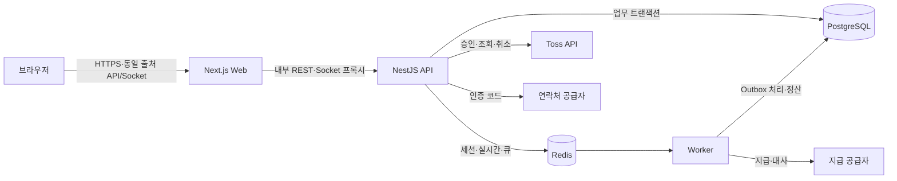

# 감자마켓 플랫폼 시큐어코딩 개발 보고서

- 작성일: 2026-07-23
- 대상: Tiny Second-hand Shopping Platform 감자마켓
- 범위: 요구사항 분석, 시스템 설계, 구현, 체크리스트와 테스팅, 유지보수
- 기준 문서: `requirements.md`, `page_desc.md`, `tech_stack.md`, `wbs.md`,
  `test_plan.md`
- 보안 기준: OWASP API Security Top 10:2023, PCI DSS v4.0.1, 최소 권한,
  심층 방어, 기본 거부

## 1. 개요와 최종 판정

감자마켓은 지역 기반 중고 상품 등록·검색, 상품 기반 1:1 채팅, 신고·차단,
직거래 요청, 에스크로 결제·취소·환불·정산 및 최고관리자 운영 기능을 제공하는
플랫폼이다. 기능을 화면에 구현하는 것에 그치지 않고 인증 우회, 객체 수준 권한
침해, 결제 위변조, 카드정보 유출, 웹훅 위조·재전송, 경쟁 상태와 비동기 작업
유실을 핵심 위협으로 선정하여 서버에서 통제하였다.

현재 구현은 로컬 샌드박스 기준으로 요구사항 추적, 빌드, 정적 검사, 단위·통합·
계약·브라우저·접근성·기초 보안·성능·Redis 장애 복구 시험을 통과했다. 실제
브라우저 기능 시험에서는 API 응답만 확인하지 않고 PostgreSQL 저장 결과까지
대조하였다. 개발 중 발견한 관리자 직렬화, readiness 무응답, 외부 HTTP 채팅,
거래 상태, 상품 처리, 비밀번호 강도 문제는 수정 후 회귀 시험을 통과했다.

따라서 판정은 다음과 같다.

| 대상 | 판정 | 근거 |
| --- | --- | --- |
| 로컬 기능·보안 출시 후보 | **GO** | 구현된 P0 흐름, 데이터 저장, 음수 보안 시험과 자동 게이트 통과 |
| 실제 운영 배포 | **조건부** | 실제 Toss·연락처·지급 공급자, TLS·운영 비밀, 백업 복원과 실기기 시험 필요 |
| P1 기능 | 출시 후 개선 | 활성 세션 개별 관리, 상품 임시저장, 최근 검색, 채팅 알림, 제재 이의제기 |

## 2. 개발 전 과정

개발은 다음 생명주기로 수행하였다.

1. 기능·보안 요구사항을 P0/P1과 사용자 역할별로 분류하였다.
2. 사용자·상품·거래·결제·정산 상태와 신뢰 경계를 설계하였다.
3. 요구사항을 화면, API, DB 모델, WBS와 테스트 ID에 연결하였다.
4. 인증, 상품, 채팅·안전, 거래·결제, 관리자, 운영 기반 순으로 구현하였다.
5. 정상·실패·권한·경계·동시성·장애 조건의 체크리스트와 자동 시험을 작성하였다.
6. 브라우저에서 두 계정 이상의 실제 흐름을 수행하고 DB 저장값을 대조하였다.
7. 발견 결함을 원인·영향·보안 통제·회귀 시험 단위로 수정하였다.
8. 실행서, 외부 수동 시험표와 잔여 위험을 유지보수 항목으로 남겼다.

요구사항을 바꿀 때 OpenAPI, 화면 설명, 상태 모델, 테스트와 추적표를 같은
변경에서 갱신하였다. 이를 통해 보안 요구사항이 선언에만 머무르지 않고 구현과
검증 증거까지 연결되도록 하였다.

## 3. 요구사항 분석

### 3.1 요구사항 범위와 충족 현황

`docs/requirements.md`의 89개 요구사항은
`docs/baseline/traceability.md`에서 WBS·화면·테스트 묶음과 연결된다.

| 영역 | 요구사항 | 구현 내용 | 로컬 판정 |
| --- | ---: | --- | --- |
| 회원·인증 | AUTH 10개 | 가입·연락처 인증·로그인·재설정·탈퇴·제재·취약 비밀번호 차단 | 통과 |
| 상품 | ITEM 9개 | 등록·조회·수정·상태 삭제·실제 이미지 검증·지역 비공개 | P0 통과, 임시저장 P1 |
| 검색 | SEARCH 7개 | 제목·설명 부분 검색, 필터·정렬·커서·인접 지역 제한 | P0 통과, 최근 검색 P1 |
| 채팅 | CHAT 6개 | 상품 1:1 방, 저장·실시간 전송, REST 대체 경로, 차단·빈도 제한 | P0 통과, 알림 설정 P1 |
| 거래·결제 | PAY 25개 | 상태 머신, 에스크로, 멱등 처리, 웹훅, 원장, 정산 보류 | 로컬 통과, 실제 공급자 조건부 |
| 신고·차단 | SAFE 9개 | 사용자·상품·메시지 신고, 차단, 제재 전파 | P0 통과, 이의제기 P1 |
| 관리자 | ADMIN 8개 | 사용자·상품·신고·거래·결제·Outbox 관리와 감사 | 통과 |
| 공통 보안 | SEC 15개 | 입력·인가·세션·비밀·로그·가용성·접근성 통제 | 로컬 통과, 운영환경 조건부 |
| **합계** | **89개** | 기준선 산출물 8개와 자동 검사로 추적 | **기준선 통과** |

### 3.2 역할과 권한

- 비회원: 공개 가능한 활성 상품과 검색 결과만 조회한다.
- 인증대기 회원: 연락처 인증 전에는 거래 기능을 사용할 수 없다.
- 활성 회원: 자신의 상품과 자신이 참여한 채팅·거래에만 쓰기 권한을 가진다.
- 정지·탈퇴 회원: 로그인 또는 신규 쓰기 작업이 차단된다.
- 최고관리자: 운영 조회와 조치가 가능하지만 고위험 작업은 비밀번호 재인증,
  사유와 감사 로그를 요구한다.
- 외부 공급자: Toss·연락처·지급 API는 별도 신뢰 경계이며 응답과 웹훅을
  내부 기록과 다시 대조한다.

### 3.3 보안·비기능 요구사항

- 인증과 객체 수준 인가는 화면이 아니라 API와 Socket.IO에서 강제한다.
- 비밀번호, 인증 코드와 세션 토큰 원문을 저장하거나 로그에 남기지 않는다.
- 카드번호, 유효기간, CVC/CVV, PIN과 전체 트랙 데이터는 플랫폼 경계를
  통과하지 않는다.
- 거래 금액·주문번호·소유자는 서버 저장값을 원본으로 사용한다.
- 결제·환불·웹훅·정산은 멱등하고 금액 이력은 추가 전용 원장으로 남긴다.
- 입력 검증, 속도 제한, 보안 헤더, 비밀 분리와 구조화 로그를 공통 적용한다.
- 장애 인스턴스는 readiness에서 빠르게 제외되고 비동기 이벤트는 복구 후
  중복 없이 다시 처리되어야 한다.

## 4. 시스템 설계

### 4.1 아키텍처

TypeScript 기반 pnpm 모노레포에 Next.js Web, NestJS API·Worker와 공통
패키지를 배치하였다. PostgreSQL을 업무 데이터의 원본으로 사용하고 Redis는
세션·실시간 확장·작업 큐에만 사용한다. 결제·원장·감사·웹훅 수신 사실은
프로세스 메모리나 Redis가 아니라 PostgreSQL에 보존한다.

### 4.2 핵심 설계 결정

- 서버 저장형 불투명 세션을 사용하고 DB에는 SHA-256 토큰 해시만 저장한다.
- 비밀번호는 Argon2id, 인증 코드는 pepper를 결합한 해시로 저장한다.
- 인증 쿠키는 HttpOnly·SameSite를 사용하며 운영에서는 Secure를 요구한다.
- NestJS 전역 `ValidationPipe`의 whitelist와 미정의 필드 거부를 적용한다.
- ORM 매개변수화와 정수 KRW 타입으로 SQL 삽입·금액 형식 오류를 줄인다.
- 거래·상품·결제 상태 전이는 허용된 상태 머신과 DB 트랜잭션으로 제한한다.
- 업무 변경과 Outbox 생성을 한 트랜잭션으로 저장한다.
- Socket 연결·방 입장·메시지마다 세션·참여자·차단 상태를 검사한다.
- 결제 성공 URL이나 웹훅 본문만으로 결제를 확정하지 않고 Toss 조회·승인
  결과와 내부 주문을 대조한다.
- 요청 ID, 구조화 로그와 관측 지표를 사용하되 비밀번호·세션·결제 비밀을
  제거한다.

### 4.3 데이터 무결성 설계

- 판매자 수락 시 상품 예약, 선택 거래 수락, 경쟁 요청 거절과 이력을 하나의
  트랜잭션에서 처리한다.
- 거래 생성과 채팅방·참여자 생성을 원자적으로 처리한다.
- 승인 전 인도 완료를 금지하고 승인된 결제만 인도 단계로 전환한다.
- 승인·취소·환불 금액은 기존 행을 덮어쓰지 않고 원장 항목으로 추가한다.
- 웹훅 전송 ID와 결제 작업의 멱등성 키에 고유성을 적용한다.
- Worker는 claim, 재시도 횟수, 다음 실행 시각, stale claim 회수와
  dead-letter 상태를 기록한다.

## 5. 구현

### 5.1 회원과 인증

가입은 이메일 또는 휴대전화, 성인 확인, 6자리 소유 인증을 요구한다. 중단된
인증대기 가입은 원래 비밀번호를 증명한 경우에만 재개한다. 비밀번호 재설정은
검증된 연락처를 사용하고 성공 시 기존 세션을 모두 폐기한다. 탈퇴는 사용자
상태 변경, 세션 폐기, 판매중 상품 숨김과 감사 로그를 한 트랜잭션에서 처리한다.

비밀번호는 12~128자, 영문 대·소문자·숫자·특수문자를 요구한다. 흔한 단어,
예측 가능한 정·역순 문자열, 4회 반복 문자와 계정 식별자 포함을 거부한다.
회원가입과 재설정 API가 `WEAK_PASSWORD`로 최종 차단하며, 취약한 재설정 값은
유효한 인증 코드를 소비하지 않는다. 화면에는 각 조건을 `✓`/`✕`로 표시하고
화면낭독기에는 `충족`/`필요` 상태를 제공한다.

### 5.2 상품과 검색

상품은 제목, 설명, 정수 가격, 카테고리, 행정동과 최대 5개 이미지를 저장한다.
이미지는 MIME 선언뿐 아니라 PNG·JPEG·WebP 실제 바이트 시그니처와 크기를
검증한다. 작성자만 수정·숨김·삭제할 수 있고 활성 거래가 있는 상품은 핵심 변경과
삭제를 차단한다. 삭제는 물리 제거가 아니라 `DELETED`, 탈퇴 상품은 `HIDDEN`
상태로 남겨 감사와 거래 이력을 보존한다.

검색은 공백으로 나눈 복수 단어가 제목 또는 설명의 대소문자 무시 부분 문자열과
일치하도록 처리한다. ORM 조건 API로 조립하고 공개 가능한 `ACTIVE` 상태와
허용된 행정동 범위를 항상 함께 적용한다. 긴 제목·설명은 카드 밖으로 넘치지
않도록 줄 제한과 강제 줄바꿈을 적용했다.

### 5.3 채팅, 신고와 차단

상품에서 거래를 요청하면 거래와 1:1 채팅방이 생성되고 채팅 상세로 이동한다.
브라우저는 현재 Web Origin의 `/socket.io`와 `/api/v1`을 사용하고 Web 서버가
내부 API로 전달한다. 외부 HTTP에서 `crypto.randomUUID`를 사용할 수 없는 경우
`crypto.getRandomValues`로 UUID v4를 생성하여 메시지·거래·결제 멱등 ID를
만든다.

실시간 ACK 실패나 연결 단절 시 같은 `clientMessageId`로 REST 저장 경로를
사용하여 메시지 유실과 중복을 방지한다. 두 경로 모두 세션·참여자·차단·메시지
길이·빈도 검사를 거친다. 메시지는 React 텍스트로 렌더링해 HTML과 스크립트를
실행하지 않는다.

### 5.4 거래, 결제와 정산

정상 상태는 다음 순서다.

`요청 → 판매자 수락·상품 예약 → 에스크로 결제 → 인도 완료 → 구매 확정 → 7일 정산 보류 → 정산`

결제 주문은 서버에 고정된 거래 금액으로 생성한다. Toss 요청에는 고유한
`Idempotency-Key`를 사용하고 승인 응답의 `paymentKey`, `orderId`, 금액과 상태를
내부 주문과 모두 대조한다. 승인 전에는 인도 버튼을 노출하지 않으며 서버도
`ESCROW_PAYMENT_REQUIRED`로 거부한다.

웹훅은 raw body, 전송 시각과 비밀키로 HMAC SHA-256을 계산해 상수 시간으로
비교한다. 오래된 시각, 서명·전송 ID 누락, 서명 불일치를 거부하고 전송 ID와
이벤트 순서로 중복·역순 처리를 막는다. 수신 기록과 Outbox는 한 트랜잭션으로
저장하고 Worker가 재시도·dead-letter 정책으로 처리한다.

결제 승인 전 수동 취소 또는 7일 미결제 만료 시 상품 예약을 해제한다. 승인된
결제의 취소 기한은 거래 생성일이 아니라 승인 시각부터 계산한다. 구매확정 후
7일 동안 정산을 보류하며 취소·환불·분쟁 시 정산을 중지한다.

### 5.5 관리자와 운영

관리자 API는 `SUPER_ADMIN` 역할을 검사한다. 사용자 정지·복구, 결제 대사,
실패 Outbox 재처리 같은 고위험 작업은 관리자 비밀번호 재인증과 사유를 요구한다.
작업자, 대상, 행위, 시각, 사유와 요청 ID를 감사 로그에 기록한다. 결제 키와
수단은 화면에서 마스킹하고 중첩된 `BigInt` 금액도 안전한 문자열 DTO로 변환한다.

상태 API는 process health와 PostgreSQL·Redis readiness를 구분한다. Redis
장애 시 연결을 무한 재시도하지 않고 제한 시간 내 503을 반환하며, 복구 후 API와
Worker가 재시작 없이 정상화되는지 시험했다.

## 6. 개발 중 발견한 보안 약점과 변경

| 확인한 약점 | 위험 | 적용한 변경 | 상태 |
| --- | --- | --- | --- |
| 길이만 검사한 비밀번호 | 추측·사전 공격과 계정 장악 | 문자군·흔한 문자열·연속·반복·식별자 검사를 가입·재설정 서버에 공통 적용 | 수정·시험 통과 |
| 화면에서만 비밀번호 강도 검사 가능성 | 직접 API 호출 우회 | 계정 생성·코드 소비 전에 서버가 `WEAK_PASSWORD`로 거부 | 수정·시험 통과 |
| 직접 `localhost:4000` 호출 | 외부 브라우저 쿠키·API 연결 실패 | 동일 출처 `/api/v1` 프록시와 쿠키 전달 적용 | 수정·시험 통과 |
| 외부 HTTP의 `randomUUID` 부재 | 채팅·멱등 요청 실행 전 예외 | `getRandomValues` 기반 UUID v4 대체 생성 | 수정·시험 통과 |
| Socket 주소가 localhost로 고정 | 외부 사용자의 실시간 연결 실패 | 동일 출처 `/socket.io` 프록시 적용 | 수정·두 계정 통과 |
| Socket 실패 시 메시지 유실 가능성 | 전송 버튼은 성공처럼 보이나 DB 미저장 | 같은 멱등 ID를 쓰는 REST 대체 저장 경로 추가 | 수정·중복 없음 |
| 인증정보 원문 저장 가능성 | DB·로그 유출 시 계정 장악 | Argon2id와 인증 코드·세션 토큰 해시, 로그 제거 | 적용 |
| 로그인·인증 코드 무제한 시도 | 무차별 대입·자원 고갈 | 로그인 5회 잠금, 인증 코드 요청·검증 횟수 제한 | 적용 |
| ID 추측으로 타인 자원 접근 | 상품·채팅·거래 IDOR | 작성자·참여자·거래 당사자 관계를 서비스에서 검사 | 수정·음수 시험 통과 |
| DTO 밖의 입력 수용 | mass assignment·상태 조작 | 전역 whitelist와 미정의 필드 거부 | 적용 |
| 업로드 MIME 신뢰 | 비이미지·스크립트 업로드 | 실제 이미지 magic byte·크기·개수 검사 | 수정·시험 통과 |
| 긴 입력으로 UI 동작 가림 | 삭제·거래 버튼 은닉 등 UI 교란 | 카드 overflow·줄 제한·강제 줄바꿈 | 수정·시험 통과 |
| 상품 삭제·탈퇴 노출 불일치 | 삭제/탈퇴 상품 거래 지속 | 상태 삭제, 활성 거래 잠금, 탈퇴 상품 원자적 숨김 | 수정·DB 대조 통과 |
| 검색 정확 일치만 지원 | 정상 상품 탐색 실패 | 매개변수화된 복수 부분 검색과 상태·지역 필터 유지 | 수정·시험 통과 |
| 거래와 채팅 생성 분리 가능성 | 고아 거래 또는 대화방 | 거래·채팅·참여자를 한 트랜잭션에서 생성 | 수정·시험 통과 |
| 복수 구매 요청 동시 수락 | 중복 예약·결제 | 상품 잠금, 한 요청 수락과 경쟁 요청 거절을 원자 처리 | 수정·동시성 통과 |
| 결제 전 인도 허용 가능성 | 에스크로 없이 거래 완료 | `Payment=APPROVED` 전 UI·API 인도 차단 | 수정·시험 통과 |
| 클라이언트 결제 결과 신뢰 | 금액·주문 변조 | 내부 주문과 Toss 승인·조회 결과 교차 검증 | 적용 |
| 웹훅 위조·재전송·역순 | 허위 결제·정산 | HMAC·시각·전송 ID·sequence 검증 | 적용 |
| 웹훅 저장 후 큐 발행 실패 | 내구 이벤트 유실 | Webhook·Outbox 단일 DB 트랜잭션 | 적용 |
| 비동기 단순 재시도 | 중복 처리·무기한 적체 | claim·backoff·stale 회수·dead-letter·관리자 재처리 | 수정·복구 통과 |
| 관리자 중첩 `BigInt` | 결제 운영 화면 500·가용성 저하 | 모든 중첩 금액을 문자열 응답으로 변환 | 수정·회귀 통과 |
| Redis readiness 무한 재접속 | 장애 인스턴스가 트래픽 수신 | 연결 제한 시간·재시도 금지·실제 ping | 수정·503/복구 통과 |
| 카드정보가 플랫폼에 유입될 가능성 | PCI 범위 확대·민감정보 유출 | Toss 호스팅 UI, 금지 필드 검사, 마스킹 정보만 저장 | 코드 통과, 실제 네트워크 확인 필요 |
| 개발 플래그의 운영 유입 | 인증 코드·sandbox 오용 | `.env` 분리, 운영 체크리스트에 debug off·Secure 쿠키 명시 | 문서화, 배포 검증 필요 |
| CSP의 `unsafe-inline` | XSS 방어 강도 저하 | origin·frame·object 제한 적용 | 잔여: nonce/hash 전환 |
| 제한된 흔한 비밀번호 목록 | 유출 비밀번호 전체 차단 불가 | 로컬 목록·패턴 우선 적용 | 잔여: 오프라인 목록 또는 k-익명 조회 |
| 협소한 기초 보안 검사 | 일반 비밀·SAST·이미지/IaC 취약점 누락 | 금지 결제 필드·Toss 비밀 검사와 CI 게이트 적용 | 잔여: 도구 범위 확대 |

## 7. 체크리스트와 테스팅

### 7.1 체크리스트 구성

`docs/test_plan.md`에는 단위, 통합, 계약, E2E, 접근성, 보안, 성능, 장애 주입과
출시 차단 기준을 정의하였다. 실제 외부 계정·실기기·복구 환경이 필요한 항목은
`docs/user-test-checklist.md`에 실행자, 환경, 증거 위치와 판정을 남긴다.

주요 보안 체크리스트는 다음과 같다.

- 보호 API·Socket.IO는 비인증 사용자를 거부하는가
- 다른 사용자 ID로 상품·채팅·거래·결제를 조회·변경할 수 없는가
- 정지·탈퇴·차단 상태가 REST와 실시간 채널에 즉시 적용되는가
- 약한 비밀번호, 미정의 필드, 경계값, 스크립트와 위장 파일이 거부되는가
- 결제 금액·주문·소유자와 공급자 결과가 일치하는가
- 멱등 요청·웹훅을 반복해도 한 번만 반영되는가
- 카드정보·비밀번호·코드·세션·비밀키가 응답·로그·DB에 없는가
- 관리자 고위험 작업이 재인증되고 감사되는가
- DB·Redis 장애를 빠르게 탐지하고 복구 후 중복 없이 처리하는가

### 7.2 자동·실사용 검증 결과

2026-07-23에 동일 워크트리의 Docker 빌드 이미지와 격리 테스트 DB를 사용했다.

| 검증 영역 | 결과·증거 |
| --- | --- |
| 전체 workspace lint·typecheck·프로덕션 빌드 | 통과 |
| 단위 테스트 | API 25건, Web 7건, Worker 2건 통과 |
| API 통합 테스트 | 인증 10건, 거래 3건, 결제 3건, 관리자 3건 통과 |
| OpenAPI 계약 | 6건 통과 |
| 요구사항 기준선 | 산출물 8개·요구사항 89개 통과 |
| 전체 브라우저 회귀 | 기능 패치 기준 29건 통과 |
| 자동 접근성 | 전체 20개 경로 통과 |
| 비밀번호 후속 회귀 | 가입·재설정 Chromium 2건, 해당 접근성 2건 통과 |
| 보안 기준선 | 금지 비밀·카드 데이터 필드 검사 통과 |
| 성능 smoke | 80요청·동시성 10·실패 0, 최근 전체 회귀 P95 146ms |
| Redis 장애 readiness | 장애 중 제한 시간 내 503, 복구 후 정상 |
| Worker Redis 복구 | 재시작 없이 5초 내 Outbox 1회 처리 |
| 실행 상태 | PostgreSQL·Redis·API·Web healthy |

### 7.3 실제 사용과 DB 대조

- 두 계정이 상품 등록 → 거래 요청 → 채팅 양방향 전송 → 판매자 수락 →
  에스크로 승인 → 인도 → 구매확정을 완료했다.
- 최종 DB는 `Trade=CONFIRMED`, `Product=SOLD`, `Payment=APPROVED`였고
  채팅 참가자 2명과 양방향 메시지가 저장됐다.
- 위장 이미지, 상품·채팅·거래 IDOR, 저장형 XSS 문자열, 결제 전 인도,
  예약 상품 변경, 차단 후 전송, 중복 신고와 로그인 대입을 실제로 거부했다.
- 비밀번호 재설정 후 기존 세션은 401이 되고 새 비밀번호 로그인은 성공했다.
- 상품 삭제는 `DELETED`, 회원 탈퇴 상품은 `HIDDEN`으로 저장되고 공개 조회는
  404가 됐다.
- Redis 장애·복구 시험과 임시 통합 DB는 서비스 데이터와 분리했으며 시험 후
  제거했다.

## 8. 유지보수 계획

### 8.1 변경과 회귀 관리

- 요구사항 변경 시 추적표, OpenAPI, 상태 모델, 화면 설명과 테스트를 함께 바꾼다.
- DB 스키마는 순방향 migration으로 관리하고 적용 전 빈 DB와 복원 DB에서 검증한다.
- 인증·결제·권한 코드는 정상 흐름뿐 아니라 우회·중복·경쟁·장애 시험을 추가한다.
- 정책 변경 시 서버와 화면의 비밀번호 테스트 벡터를 같은 변경에서 갱신한다.

### 8.2 취약점과 의존성 관리

- lockfile을 고정하고 정기적으로 SCA를 실행한다.
- Critical·High는 출시를 차단하고 예외는 보완 통제·담당자·만료일을 기록한다.
- SAST, 범용 secret scan, SBOM, 컨테이너와 IaC 검사를 CI 차단 잡으로 확대한다.
- Node.js, PostgreSQL과 Redis는 EOL 전에 이전 및 복원 리허설을 수행한다.

### 8.3 운영과 사고 대응

- 결제 미확정, Outbox 적체·dead-letter, 정산 실패, 웹훅 서명 실패, 로그인 잠금,
  관리자 고위험 작업을 지표와 경보로 감시한다.
- 대사·재처리는 재인증과 감사가 적용된 관리자 기능만 사용하고 정상 복구를 위해
  DB 상태를 직접 수정하지 않는다.
- 운영 비밀은 저장소나 이미지에 넣지 않고 비밀 관리 시스템에서 런타임 주입한다.
- 백업은 본 DB와 같은 암호화·접근·보존·삭제 정책을 적용하고 정기 복원 시험을
  수행한다.

## 9. 운영 전 잔여 시험과 위험

| ID | 남은 시험 | 운영 승인 조건 |
| --- | --- | --- |
| UT-EXT-001 | 실제 Toss 승인·취소·환불·웹훅 | 테스트 콘솔·키로 주문/금액/서명/네트워크 카드정보 부재 증거 |
| UT-EXT-002 | 실제 이메일·SMS 인증 전달 | debug code 비활성화, 만료·재전송·장애·개인정보 확인 |
| UT-EXT-003 | 실제 지급·정산 | 지급 멱등성, 7일 보류, 실패·대사 증거 |
| UT-UX-001 | 모바일·Firefox·WebKit·스크린리더 | 핵심 가입·상품·채팅·거래 흐름 수동 통과 |
| UT-OPS-001 | 백업 복원·경보·롤백 | 격리 복원, 데이터 개수 대조, 장애 경보와 복구 기록 |

추가 보안 개선 항목은 CSP nonce/hash 전환, 체계적인 전 객체 IDOR 매트릭스,
CSRF·SQLi·XSS·SSRF·path traversal 동적 검사, WebSocket flood/replay,
다중 API 인스턴스 rate limit, 대규모 유출 비밀번호 차단과 Git 이력 secret
검사다.

운영에서는 최소한 다음 설정을 강제해야 한다.

- `AUTH_DEBUG_CODES=false`
- `COOKIE_SECURE=true`
- 정확한 `WEB_ORIGIN`과 HTTPS/WSS
- 충분히 긴 무작위 `AUTH_CODE_PEPPER`
- 실제 Toss·웹훅·연락처·지급 비밀의 비밀 관리 시스템 주입
- `TOSS_SANDBOX_MODE=false`, `NEXT_PUBLIC_PAYMENT_SANDBOX_MODE=false`

## 10. 결론

감자마켓은 요구사항 분석 단계에서 기능과 보안을 함께 정의하고, 객체 수준 인가,
입력 경계, 인증정보 해시, 결제 교차 검증, 멱등성, 불변 원장, 트랜잭셔널
Outbox와 감사 가능성을 시스템 설계와 구현에 반영했다. 이후 실제 브라우저와 DB를
사용한 시험에서 발견한 약점을 수정하고 자동 회귀로 고정하였다.

이 결과는 시큐어코딩을 마지막 점검이 아니라 요구사항 → 설계 → 구현 → 시험 →
운영·유지보수 전체 과정에 적용한 개발 결과다. 로컬 기능·보안 후보는 GO이며,
실제 운영은 외부 공급자와 운영환경의 남은 필수 시험 증거를 확보한 후 최종
승인해야 한다.

## 부록 A. 근거 문서

- `docs/requirements.md`: 제품·보안·결제 요구사항 89개
- `docs/baseline/traceability.md`: 요구사항·화면·WBS·테스트 추적성
- `docs/baseline/openapi.yaml`: API 계약과 보안 조건
- `docs/baseline/domain-state-model.md`: 사용자·상품·거래·결제 상태
- `docs/baseline/payment-threat-model.md`: 결제 신뢰 경계와 위협 통제
- `docs/test_plan.md`: 자동·수동 시험과 출시 게이트
- `docs/user-test-checklist.md`: 외부 공급자·실기기·복구 증거 양식
- `docs/deep-functional-test-report-2026-07-23.md`: 심층 기능·DB 대조
- `docs/patch-validation-report-2026-07-23.md`: 기능 패치 전체 회귀
- `docs/chat-external-fix-report-2026-07-23.md`: 외부 채팅 장애 수정
- `docs/trade-flow-fix-report-2026-07-23.md`: 거래 상태·동시성 수정
- `docs/password-strength-fix-report-2026-07-23.md`: 취약 비밀번호 차단
- `docs/operations-runbook.md`: 운영·장애·복구 절차
