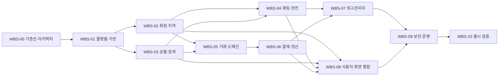

# 감자마켓 Codex 활용 개발 WBS

## 1. 문서 정보

- 목적: 감자마켓 요구사항과 화면 설계를 Codex가 구현, 검증, 리뷰할 수 있는
  작업 단위로 분해한다.
- 기준 문서: [제품 요구사항](./requirements.md), [페이지 구성 설계](./page_desc.md),
  [기술 스택 및 개발 계획](./tech_stack.md)
- 기준 범위: 요구사항 88개와 페이지 29개
- 작업 원칙: 한 작업은 명시된 요구사항 ID, 변경 범위, 검증 방법, 완료 증거를
  가져야 한다.
- 일정 표기: 팀 가용성이 정해지지 않았으므로 달력 일수 대신 `S`, `M`, `L`,
  `XL` 복잡도로 표시한다.

## 2. 목표와 완료 조건

최종 목표는 비회원 상품 탐색부터 회원가입, 상품 등록, 1:1 채팅, 직거래 요청,
토스페이먼츠 에스크로 결제, 인도, 구매확정, 7일 정산 보류, 신고·차단 및
최고관리자 운영까지 하나의 일관된 서비스로 제공하는 것이다.

개발 완료는 다음 조건을 모두 만족할 때로 정의한다.

1. 모든 P0 요구사항이 구현되고 요구사항 ID와 자동화 테스트가 연결된다.
2. 29개 페이지가 권한, 로딩, 빈 결과, 오류, 차단, 정지, 오프라인 상태를
   포함해 구현된다.
3. 카드 계정 데이터가 감자마켓 클라이언트, 서버, 로그, 분석, 저장소를 거치지
   않으며 PCI DSS SAQ A 적용 가능성이 확인된다.
4. 결제, 환불, 정산, 웹훅이 멱등하고 불변 원장 및 대사 결과로 검증된다.
5. 권한, 객체 소유권, 차단, 제재가 UI뿐 아니라 API와 실시간 채널에서 강제된다.
6. 보안, 성능, 접근성, 장애 복구 및 운영 준비도 게이트를 통과한다.
7. 보류 정책 중 출시 차단 항목이 결정되고 문서, 코드, 테스트에 반영된다.

## 3. 개발 전제와 출시 차단 결정

### 3.1 확정 기술 기준선

| 영역 | 확정 선택 |
| --- | --- |
| 개발 기반 | Node.js 24 LTS, TypeScript 6.0.x, pnpm 10 workspaces |
| 웹 | Next.js 16 App Router, React 19.2, Tailwind CSS 4, TanStack Query 5 |
| API | NestJS 11, Express 5, REST `/api/v1`, OpenAPI 3 |
| 데이터 | PostgreSQL 18, Prisma 7, PostgreSQL FTS + `pg_trgm` |
| 실시간·비동기 | Socket.IO 4, Redis 8, BullMQ |
| 파일·결제 | P0 PostgreSQL 이미지 바이트 저장, 조건부 S3 호환 전환, Toss JavaScript SDK v2 |
| 인증·보안 | 불투명 서버 세션, Argon2id, Helmet, Throttler, TLS 1.2+ |
| 관측성 | Pino 구조화 로그, OpenTelemetry |
| 테스트 | Jest, Testing Library, Supertest, Playwright, axe-core, k6 |

구현은 pnpm 모노레포의 `apps/web`, `apps/api`, `apps/worker`와 공통
`packages/*`로 구성한다. 상세 경계, 버전, 대안과 업그레이드 정책은
`tech_stack.md`를 따른다.

### 3.2 승인된 제품·운영 결정

DEC-01~05는 2026-07-15, DEC-06은 2026-07-18 승인된 값이다. 후속 작업은 이 대장을 준수하며, DEC-05의 수치 기준은 성능 판정 전에 보완한다.

| 결정 ID | 승인값 | 구현 범위 | 남은 조건 |
| --- | --- | --- | --- |
| DEC-01 | Toss sandbox와 테스트 UI까지만 구현 | 실결제·실정산, MID, 지급대행·판매자 본인확인 연동 제외 | 실연동은 별도 계약·승인 필요 |
| DEC-02 | 최고관리자 1인이 분쟁 최종 처리 | 재인증·사유·감사 로그를 가진 도메인 명령으로 구현 | 증빙은 탈퇴 사용자 데이터와 같이 1년 보존 |
| DEC-03 | 별도 승인자 없음 | 최고관리자 재인증, 사유, 변경 전후 감사 로그 필수 | 상태 직접 덮어쓰기 금지 |
| DEC-04 | 개인정보·채팅·거래는 탈퇴 후 1년, 로그는 생성 후 2년 보존 | 보존·삭제·익명화 작업과 시간 경계 테스트 구현 | 법적 보존 예외를 운영 정책에 추가 |
| DEC-05 | 소규모 웹사이트 기준으로 우선 구현 | 측정 환경과 후보 기준 마련 | 동시 사용자·데이터·요청 비율 수치 확정 필요 |
| DEC-06 | 소규모 서비스의 상품 이미지는 PostgreSQL 바이트로 저장 | 실제 형식·크기 검증과 비공개 API 반환 | 용량·트래픽 증가 시 S3 호환 저장소 전환 ADR 필요 |

지원 브라우저 기준선은 Next.js 16 기본 하한인 Chrome/Edge/Firefox 111 이상과
Safari 16.4 이상으로 확정한다. 실제 지원 범위 확대는 분석 자료가 확보되면 별도
결정으로 관리한다.

## 4. Codex 작업 운영 규칙

### 4.1 작업 입력 계약

각 Codex 작업 프롬프트에는 다음 내용을 포함한다.

| 항목 | 필수 내용 |
| --- | --- |
| 작업 ID | 이 문서의 `WBS-nn.nn` |
| 근거 | 요구사항 ID, 페이지 ID, 관련 ADR 또는 정책 결정 |
| 목표 | 사용자 관점의 관찰 가능한 결과 |
| 변경 범위 | 소유 파일과 수정 가능한 모듈 |
| 제외 범위 | 인접하지만 이번 작업에서 변경하지 않을 기능 |
| 인수 조건 | 정상, 오류, 권한, 경계값을 포함한 테스트 가능한 조건 |
| 검증 | 실행할 단위·통합·E2E·보안 검사 명령 |
| 완료 증거 | 변경 파일, 테스트 결과, 남은 위험 |

### 4.2 역할 분담

| Codex 역할 | 책임 | 권장 사용 시점 |
| --- | --- | --- |
| 탐색 담당 | 기존 구조, 패턴, 영향 파일과 테스트 위치 파악 | 모든 구현 작업 시작 전 |
| 설계 담당 | ADR, 상태 모델, API·데이터 경계 검토 | `WBS-00`, 결제·권한 변경 |
| 구현 담당 | 제한된 작업 범위의 코드와 테스트 작성 | 각 기능 작업 |
| 테스트 담당 | 경계값, 실패, 경쟁 상태, E2E 시나리오 작성 | 기능과 독립된 검증이 필요할 때 |
| 보안 검토 담당 | 인증·인가, 카드 데이터, 비밀값, 웹훅 위협 검토 | 결제와 출시 게이트 |
| 검증 담당 | 인수 조건과 실제 증거 대조, 회귀 확인 | 작업·마일스톤 종료 시 |

독립 모듈은 Codex 네이티브 서브에이전트로 병렬 조사 또는 구현할 수 있다.
공유 상태 모델, 데이터베이스 마이그레이션, API 계약 파일은 한 작업만 소유한다.
기능 구현은 가능한 한 `apps/web`, `apps/api`, `apps/worker`의 세로 기능
단위로 나누되, Prisma schema·migration과 OpenAPI 원본 계약은 단계별 단일
소유자가 순차 반영한다.

### 4.3 작업 완료 정의

- 구현과 같은 변경 묶음에 자동화 테스트가 있다.
- 입력 검증과 권한 검사를 클라이언트와 서버 양쪽 관점에서 확인했다.
- 오류 응답에 내부 예외, 비밀값, 객체 존재 여부가 노출되지 않는다.
- 린트, 타입 검사, 단위 테스트, 관련 통합 테스트가 통과한다.
- 사용자 화면은 키보드, 모바일, 로딩·빈 결과·오류 상태를 확인했다.
- 문서와 API 스키마가 실제 동작과 일치한다.
- 요구사항 추적표에 테스트 ID와 구현 상태가 기록된다.

## 5. 의존성 및 병렬화

- `WBS-02`와 `WBS-03`은 공통 인증·데이터 계약이 고정된 뒤 병렬 진행한다.
- `WBS-04`는 회원과 상품의 식별자·권한 모델에 의존한다.
- `WBS-05`는 거래 상태 전이의 단일 소유 작업으로 진행한다.
- `WBS-06`은 거래 상태 모델과 토스페이먼츠 계약 결정 후 시작한다.
- 사용자 화면은 도메인 API와 병렬로 목 서버를 사용할 수 있지만, 마일스톤
  종료 전 실제 API 계약 테스트로 교체한다.
- 관리자 화면은 각 도메인의 조회·명령 API가 안정된 뒤 병렬 구현한다.
- `apps/web`, `apps/api`, `apps/worker`는 계약이 고정된 기능부터 병렬
  구현하고 `packages/contracts` 생성 결과로 통합한다.
- Prisma migration과 OpenAPI 원본은 동시에 둘 이상의 작업에서 수정하지 않는다.

## 6. 상세 WBS

### WBS-00 기준선과 기술 의사결정

| ID | 작업 | 산출물·인수 조건 | 근거 | 선행 | 규모 |
| --- | --- | --- | --- | --- | --- |
| WBS-00.01 | 요구사항 기준선 고정 | 88개 요구사항과 29개 페이지의 중복·누락 검사, 추적표 생성 | 전체 | 없음 | S |
| WBS-00.02 | 보류 정책 결정 관리 | DEC-01~06 소유자, 기한, 출시 차단 여부 기록 | 요구사항 10장, 화면 21장 | 없음 | S |
| WBS-00.03 | 기술 스택 기준선 검증 | `tech_stack.md`의 버전 호환성, 모듈형 모놀리스와 독립 배포 구조를 ADR로 고정 | SEC-008, SEC-014 | 없음 | M |
| WBS-00.04 | 도메인·상태 ADR | 사용자, 상품, 신고, 거래, 결제, 정산 상태 및 허용 전이 정의 | 요구사항 6장 | WBS-00.03 | M |
| WBS-00.05 | 데이터·API 계약 | `/api/v1` OpenAPI, 식별자, 오류 형식, 커서 페이지네이션, UTC, 최소 통화 단위 `BIGINT` 확정 | SEC-002, SEC-007 | WBS-00.04 | M |
| WBS-00.06 | 결제 위협 모델 | 신뢰 경계, 카드 데이터 흐름, 리다이렉트·웹훅·대사 위협과 통제 매핑 | PAY-016~025, SEC-009~015 | WBS-00.03 | L |

### WBS-01 저장소와 플랫폼 기반

| ID | 작업 | 산출물·인수 조건 | 근거 | 선행 | 규모 |
| --- | --- | --- | --- | --- | --- |
| WBS-01.01 | 저장소·앱 골격 | pnpm workspace에 Next `web`, Nest `api`·`worker`, 공통 packages, Compose 로컬 인프라 구성 | WBS-00.03 | WBS-00 | M |
| WBS-01.02 | CI 품질 게이트 | frozen lockfile, ESLint CLI, 타입, Jest·Playwright, 의존성·비밀 스캔 자동 실행 | SEC-008 | WBS-01.01 | M |
| WBS-01.03 | 환경·비밀 관리 | 개발·테스트·스테이징 분리, 비밀 관리 시스템, 로그 마스킹 | PAY-024, SEC-006~007 | WBS-01.01 | M |
| WBS-01.04 | 공통 API 기반 | NestJS 11 전역 ValidationPipe, 오류 매핑, 요청 ID, Helmet, Throttler, OpenAPI | SEC-002~005, SEC-007 | WBS-01.01 | L |
| WBS-01.05 | 데이터 기반 | PostgreSQL 18·Prisma 7 migration, 트랜잭션, outbox, 감사·원장 불변성 제약 | PAY-009~011, SEC-014 | WBS-00.04 | L |
| WBS-01.06 | UI 기반 | Next App Router·Tailwind 4 디자인 토큰, 레이아웃, 공통 상태, axe 검사 | 화면 5, 14~19장 | WBS-01.01 | L |
| WBS-01.07 | 관측성 기반 | Pino 구조화 로그, OpenTelemetry 추적·메트릭, 민감정보 필터, 경보 골격 | PAY-024~025, SEC-007 | WBS-01.03 | M |

### WBS-02 회원, 인증, 계정과 지역

| ID | 작업 | 산출물·인수 조건 | 근거 | 선행 | 규모 |
| --- | --- | --- | --- | --- | --- |
| WBS-02.01 | 가입·소유 인증 | 중복 방지, 인증대기, 연락처 인증, 성인 확인 | AUTH-001~002, AUTH-008; AUTH-02~03 | WBS-01 | L |
| WBS-02.02 | 로그인·세션 | Argon2id, Redis/DB 불투명 세션, HttpOnly·Secure 쿠키, 실패 제한과 즉시 폐기 | AUTH-003, AUTH-006~007, SEC-001, SEC-004; AUTH-01 | WBS-02.01 | L |
| WBS-02.03 | 비밀번호 재설정 | 검증 연락처 기반 재설정과 기존 세션 처리 | AUTH-004; AUTH-04 | WBS-02.02 | M |
| WBS-02.04 | 계정·탈퇴 | 상태 조회, 탈퇴 요청, 정책 확정 전 보존 게이트 | AUTH-005, AUTH-009; ACCOUNT-02 | WBS-02.02, DEC-04 | M |
| WBS-02.05 | 행정동·인접 지역 | 동 단위 저장·표시, 인접동 판정, 상세 주소·좌표 배제 | ITEM-009, SEARCH-005~006 | WBS-01.05 | M |
| WBS-02.06 | 계정 화면 통합 | 로그인부터 내 활동 홈까지 권한별 흐름과 복귀 경로 | AUTH-01~04, ACCOUNT-01~02 | WBS-02.01~05 | M |

### WBS-03 상품과 검색

| ID | 작업 | 산출물·인수 조건 | 근거 | 선행 | 규모 |
| --- | --- | --- | --- | --- | --- |
| WBS-03.01 | 상품 모델·권한 | 상태 전이, 작성자 소유권, 활성 거래 중 변경 잠금 | ITEM-001~004, ITEM-006~007 | WBS-01.05 | L |
| WBS-03.02 | 이미지 파이프라인 | 실제 형식·개수·크기 검증, 안전 저장, 대체 텍스트 | ITEM-005, SEC-003 | WBS-01.03 | L |
| WBS-03.03 | 상품 등록·수정 UI | 업로드 진행, 필드 오류, 중복 제출 방지, 상태 잠금 | SELL-01~02 | WBS-03.01~02, WBS-01.06 | L |
| WBS-03.04 | 상품 조회·관리 UI | 목록·상세·내 상품 상태별 행동과 비공개 객체 처리 | ITEM-002~003, ITEM-007~008; PUB-01, PUB-03, SELL-03 | WBS-03.01 | L |
| WBS-03.05 | 검색 인덱스·API | PostgreSQL FTS·`pg_trgm`, 필터·정렬·커서 페이지네이션, 숨김 즉시 제외 | SEARCH-001~006 | WBS-02.05, WBS-03.01 | XL |
| WBS-03.06 | 검색 UI | 필터 바텀 시트, URL 상태, 스크롤 복원, 빈 결과·오류 | PUB-02 | WBS-03.05 | L |
| WBS-03.07 | P1 임시저장·최근검색 | P0 안정화 후 독립 플래그로 구현 | ITEM-008, SEARCH-007 | WBS-03.03, WBS-03.06 | M |

### WBS-04 채팅, 신고와 차단

| ID | 작업 | 산출물·인수 조건 | 근거 | 선행 | 규모 |
| --- | --- | --- | --- | --- | --- |
| WBS-04.01 | 1:1 대화 모델 | 상품별 당사자 방, 참여자 인가, 읽지 않은 수 | CHAT-001~003 | WBS-02, WBS-03.01 | L |
| WBS-04.02 | 실시간 메시지 | Socket.IO 연결·이벤트 인가, 길이·빈도 제한, 중복 제거, 재연결·재시도 | CHAT-003~005, SEC-003~005 | WBS-04.01 | XL |
| WBS-04.03 | 채팅 화면 | 목록·대화, 상품 요약, 연결·전송·읽기 전용 상태 | CHAT-01~02 | WBS-04.02 | L |
| WBS-04.04 | 신고 접수·조회 | 사용자·상품·메시지 신고, 남용 제한, 공개 범위 통제 | SAFE-001~003, SAFE-008; SAFE-01~02 | WBS-04.01 | L |
| WBS-04.05 | 차단 집행 | 신규 채팅·거래 금지, 기존 대화·상품 숨김, 해제 복원 | SAFE-004~006; SAFE-03 | WBS-04.01, WBS-03.05 | L |
| WBS-04.06 | 제재 즉시 반영 | 기존 세션과 실시간 연결에서 정지·차단 즉시 강제 | AUTH-006, CHAT-004, SAFE-007 | WBS-04.02, WBS-04.05 | M |
| WBS-04.07 | P1 알림·이의제기 | 알림 설정과 제재 이의제기 | CHAT-006, SAFE-009 | P0 완료 | M |

### WBS-05 직거래 도메인

| ID | 작업 | 산출물·인수 조건 | 근거 | 선행 | 규모 |
| --- | --- | --- | --- | --- | --- |
| WBS-05.01 | 거래 요청·수락 | 판매중·가까운 지역·차단 여부 검증, 가격·조건 스냅샷 | PAY-001~003 | WBS-02.05, WBS-03, WBS-04.05 | L |
| WBS-05.02 | 거래 상태 머신 | 허용 전이, 구매자·판매자 명령 권한, 상태 이력 | PAY-005~006, PAY-011 | WBS-00.04, WBS-05.01 | XL |
| WBS-05.03 | 동시 구매 제어 | 한 상품의 한 거래만 결제 성공하도록 DB 제약·잠금 적용 | PAY-005, PAY-009~011 | WBS-05.02 | L |
| WBS-05.04 | 인도·구매확정 | 판매자 인도 완료, 구매자 확정, 서버 시각 기록 | PAY-006 | WBS-05.02 | M |
| WBS-05.05 | 자동확정 작업 | BullMQ 지연 작업과 DB 보상 조회, 인도 후 7일, 분쟁 중지, 재실행 멱등성 | PAY-007, PAY-009 | WBS-05.04 | L |
| WBS-05.06 | 취소·환불·분쟁 규칙 | 7일 창, 인도 전 조건, 정산 중지, 증빙 접수 | PAY-012~015, DEC-02 | WBS-05.02 | XL |
| WBS-05.07 | 거래 화면 | 목록, 타임라인, 역할별 행동, 절대 기한과 남은 시간 | TRADE-01~02 | WBS-05.01~06 | L |

### WBS-06 토스페이먼츠 결제, 에스크로와 정산

| ID | 작업 | 산출물·인수 조건 | 근거 | 선행 | 규모 |
| --- | --- | --- | --- | --- | --- |
| WBS-06.01 | 주문·결제 레코드 | 서버 금액, orderId, paymentKey, 마스킹 정보, 상태 분리 | PAY-003, PAY-010, PAY-017 | WBS-05.02 | L |
| WBS-06.02 | 결제위젯 연동 | Toss JavaScript SDK v2 호스팅 UI만 사용, 자체 카드 필드와 카드 원문 수집 없음 | PAY-004, PAY-016; PAY-01 | DEC-01, WBS-06.01 | L |
| WBS-06.03 | 승인 확인 API | 소유자·주문·금액 검증 후 서버 승인, 위변조 거부 | PAY-018; PAY-02 | WBS-06.02 | XL |
| WBS-06.04 | 멱등 요청 원장 | 모든 Toss POST 키와 최초 결과 보존, 15일 이후 중복 방지 | PAY-009, PAY-019 | WBS-06.01 | L |
| WBS-06.05 | 일반 결제 웹훅 | raw body 내구 저장·outbox 후 10초 응답, 조회 재검증, BullMQ 비동기 처리 | PAY-020, PAY-022~023 | WBS-06.03~04 | XL |
| WBS-06.06 | 지급 웹훅 서명 | Nest raw body·시각 기반 HMAC SHA-256, 상수시간 비교, 중복·역순 방어 | PAY-021~023 | DEC-01, WBS-06.05 | L |
| WBS-06.07 | 불변 원장·환불 | 결제·취소·환불 금액과 사유를 추가 전용으로 기록 | PAY-010, PAY-013~015 | WBS-06.04 | XL |
| WBS-06.08 | 정산 보류·지급 | 구매확정 후 7일 보류, 분쟁·환불 시 정지, 실패 재처리 | PAY-008, PAY-015 | DEC-01, WBS-05.05, WBS-06.07 | XL |
| WBS-06.09 | 장애·대사 | 서킷 브레이커, 미확정 상태, 조회 기반 정기·수동 대사 | PAY-011, PAY-025 | WBS-06.03~06 | L |
| WBS-06.10 | 결제 결과 UI | 확인 중, 승인, 미확정, 실패, 위변조, 중복 상태 분리 | PAY-02, SYS-01 | WBS-06.03, WBS-06.09 | M |

### WBS-07 최고관리자 운영

| ID | 작업 | 산출물·인수 조건 | 근거 | 선행 | 규모 |
| --- | --- | --- | --- | --- | --- |
| WBS-07.01 | 관리자 인증 경계 | 별도 경로, 지정 1인, 공유 계정 금지, 고위험 재인증 | ADMIN-001, ADMIN-006~007; ADMIN-01 | WBS-02.02 | L |
| WBS-07.02 | 운영 조회 API | 사용자·상품·신고·거래·결제 조건 검색과 마스킹 | ADMIN-002, ADMIN-005 | 관련 도메인 완료 | XL |
| WBS-07.03 | 사용자·상품 조치 | 경고·정지·복구·거래 제한·상품 숨김, 사유 필수 | SAFE-007, ADMIN-003; ADMIN-03~04 | WBS-07.01~02 | L |
| WBS-07.04 | 신고 처리 | 대기열, 검토, 조치·기각, 내부 메모 비공개 | SAFE-002, SAFE-008, ADMIN-003; ADMIN-05 | WBS-04.04, DEC-02 | L |
| WBS-07.05 | 거래·결제 운영 | 원장·웹훅·대사 조회, 승인된 명령만 제공 | ADMIN-02, ADMIN-06 | WBS-06 | XL |
| WBS-07.06 | 감사 로그 | 수행자·사유·전후값, 민감정보 마스킹, 수정·삭제 금지 | ADMIN-004; ADMIN-07 | WBS-01.05, WBS-07.01 | L |
| WBS-07.07 | 운영 홈·P1 지표 | P0 작업 대기열, P1 처리 시간과 장애·대사 지표 | ADMIN-008; ADMIN-02 | WBS-07.02~06 | M |

### WBS-08 화면 통합과 사용성

| ID | 작업 | 산출물·인수 조건 | 근거 | 선행 | 규모 |
| --- | --- | --- | --- | --- | --- |
| WBS-08.01 | 공통 내비게이션 | 데스크톱·모바일·관리자 메뉴와 역할별 노출 | 화면 5장 | WBS-01.06 | M |
| WBS-08.02 | 공통 컴포넌트 | 화면 15장의 12개 컴포넌트와 모든 주요 상태 | 화면 15, 19장 | WBS-01.06 | L |
| WBS-08.03 | 반응형 검증·수정 | 4개 구간에서 오버랩, 잘림, 레이아웃 이동 없음 | 화면 16장 | 모든 P0 화면 | L |
| WBS-08.04 | 접근성 구현 | WCAG 2.2 AA, 키보드, 44px, 라이브 영역, 축소 모션 | 화면 17장, SEC-015 | 모든 P0 화면 | L |
| WBS-08.05 | 콘텐츠 일관성 | 고정 용어, 절대 기한, 실패 추정 금지 문구 적용 | 화면 18장 | 모든 P0 화면 | M |
| WBS-08.06 | 분석 최소화 | 민감 화면 수집 제외, 가명 식별자, 서버 검증 성공만 집계 | 화면 20장, PAY-016 | WBS-06 | M |

### WBS-09 보안, 품질과 운영 준비

| ID | 작업 | 산출물·인수 조건 | 근거 | 선행 | 규모 |
| --- | --- | --- | --- | --- | --- |
| WBS-09.01 | 전송·저장 보호 | 웹·API·PostgreSQL·Redis TLS 1.2+, 취약 암호 차단, 봉투 암호화와 키 분리 | SEC-006, SEC-009~010, SEC-013 | WBS-01 | L |
| WBS-09.02 | 결제 페이지 보호 | CSP, 스크립트 허용목록, 변경 탐지, 제3자 스크립트 최소화 | SEC-011, PAY-016 | WBS-06.02 | L |
| WBS-09.03 | API 보안 검증 | OWASP API Top 10 기반 BOLA, 인증, 자원 고갈, SSRF 검사 | SEC-002~005, SEC-012 | 전체 API | XL |
| WBS-09.04 | PCI DSS 증적 | 데이터 흐름도, SAQ A 적격성, CHD 부재 증거, ASV 필요성 검토 | SEC-014, PAY-016~024 | WBS-06, DEC-01 | XL |
| WBS-09.05 | ISO·ISMS-P 통제 매핑 | ISO 25010·27001 및 적용 ISMS-P 통제와 증거 소유자 | SEC-014 | 전체 | L |
| WBS-09.06 | 백업·복구·운영절차 | 복구 시험, 대사·웹훅 재처리, 장애·보안 사고 대응서 | PAY-023~025, SEC-014 | WBS-01.07, WBS-06 | L |
| WBS-09.07 | 성능 튜닝 | 검색·일반 GET P95 1초, 외부 Toss 지연 분리 측정 | 요구사항 8.3 | DEC-05, 전체 P0 | L |

### WBS-10 통합 검증과 출시

| ID | 작업 | 산출물·인수 조건 | 근거 | 선행 | 규모 |
| --- | --- | --- | --- | --- | --- |
| WBS-10.01 | 핵심 여정 E2E | 요구사항 9장의 18개 인수 시나리오 자동화 | 요구사항 9장 | WBS-02~08 | XL |
| WBS-10.02 | 회귀·호환성 | P0 전체, 브라우저·반응형·오프라인 회귀 | 화면 14, 16, 19장 | DEC-05 | L |
| WBS-10.03 | 경쟁·시간 경계 검증 | 동시 구매, 중복 웹훅, 7일 경계, 타임아웃·재시도 | PAY-005, PAY-007~009, PAY-011~025 | WBS-05~06 | XL |
| WBS-10.04 | 보안·접근성 판정 | 고위험 취약점 0건, WCAG 2.2 AA 차단 결함 0건 | SEC-001~015 | WBS-09 | L |
| WBS-10.05 | 운영 리허설 | 결제 장애, 웹훅 지연, 대사, 정산 실패, 사용자 정지 훈련 | PAY-011, PAY-023~025, SAFE-007 | WBS-09.06 | L |
| WBS-10.06 | 출시 판정 | P0 추적률 100%, 보류 정책 해소, 승인된 잔여 위험 기록 | 요구사항 11장, 화면 22장 | WBS-10.01~05 | M |

## 7. 마일스톤

| 마일스톤 | 포함 작업 | 종료 조건 |
| --- | --- | --- |
| M0 기준선 | WBS-00 | 기술 기준선 ADR, 상태 모델, OpenAPI 규약, 결정대장 승인 |
| M1 탐색 가능한 마켓 | WBS-01~03 | 가입·로그인, 동 단위 상품 등록·조회·검색 E2E 통과 |
| M2 소통과 안전 | WBS-04 | 참여자 전용 채팅, 신고, 차단 즉시 집행 E2E 통과 |
| M3 직거래 | WBS-05 | 요청부터 인도·확정·분쟁 중지까지 상태 전이 통과 |
| M4 에스크로 | WBS-06 | 샌드박스 결제·웹훅·환불·7일 정산·대사 통과 |
| M5 운영 가능 | WBS-07~09 | 관리자 감사, 보안, 접근성, 성능, 복구 게이트 통과 |
| M6 출시 후보 | WBS-10 | P0 추적률 100%, 차단 결함 0건, 보류 정책 해소 |

## 8. 요구사항 추적 요약

| 요구사항 범위 | 구현 WBS | 주요 화면 | 테스트 묶음 |
| --- | --- | --- | --- |
| AUTH-001~009 | WBS-02 | AUTH-01~04, ACCOUNT-01~02 | `*-AUTH-*` |
| ITEM-001~009 | WBS-03 | PUB-01, PUB-03, SELL-01~03 | `*-ITEM-*` |
| SEARCH-001~007 | WBS-02.05, WBS-03.05~07 | PUB-01~02 | `*-SEARCH-*` |
| CHAT-001~006 | WBS-04.01~03, WBS-04.07 | CHAT-01~02 | `*-CHAT-*` |
| PAY-001~015 | WBS-05, WBS-06.07~08 | TRADE-01~02, PAY-01~02 | `*-TRADE-*`, `UT-TIME-*` |
| PAY-016~025 | WBS-06, WBS-09.02~04 | PAY-01~02, ADMIN-06, SYS-01 | `*-PAY-*`, `COMP-PCI-*`, `RES-*` |
| SAFE-001~009 | WBS-04.04~07, WBS-07.03~04 | SAFE-01~03, ADMIN-03~05 | `*-SAFE-*` |
| ADMIN-001~008 | WBS-07 | ADMIN-01~07 | `*-ADMIN-*`, `*-AUDIT-*` |
| SEC-001~015 | WBS-01, WBS-09 | 전 화면과 API | `SEC-*`, `A11Y-*`, `COMP-*` |

상세 테스트 ID와 판정 기준은 [테스트 전략 및 명세](./test_plan.md)에서 관리한다.

## 9. Codex 실행 순서

1. 작업 시작 시 기준 문서와 선행 작업의 실제 코드를 읽고 영향 범위를 기록한다.
2. 작업 ID 하나를 선택해 인수 조건과 실패 조건을 테스트로 먼저 고정한다.
3. 공유 계약 변경이 필요하면 해당 ADR·API 스키마의 단일 소유 작업에서 먼저
   반영한다.
4. 최소 범위로 구현하고 관련 단위·통합 테스트를 실행한다.
5. 화면 작업은 대표 데스크톱·모바일 뷰포트에서 스크린샷과 키보드 흐름을
   검증한다.
6. 결제·권한 작업은 별도 보안 검토와 경쟁 상태 테스트를 수행한다.
7. 검증 담당이 요구사항 ID, 테스트 결과, 남은 위험을 대조한 뒤 작업을 닫는다.
8. 마일스톤 종료 시 전체 회귀와 추적률 검사를 수행한다.

## 10. 진행 현황 형식

| 작업 ID | 상태 | 구현 링크 | 테스트 ID | 검증 결과 | 잔여 위험 |
| --- | --- | --- | --- | --- | --- |
| WBS-00.01~06 | 검토중 | `docs/baseline/` | DOC-TRACE-001 | 기준선 검사 통과 | M0 문서 승인 필요 |
| WBS-01.01~07 | 검토중 | `README.md`, `apps/`, `packages/`, `compose.yaml` | F0-QUALITY-001~008 | 린트·타입·빌드·단위·계약·보안·E2E·접근성 통과 | 운영 환경 의존성 실연결, 원격 관측 백엔드 연동은 후속 검토 |
| WBS-02.01~06 | 검토중 | `apps/api/src/auth`, `apps/api/src/neighborhoods`, `apps/web/app` | E2E-AUTH-001~005, API-AUTH-003·006, SEC-AUTH-004, API-REGION-001 | 가입·세션·재설정·탈퇴·행정동 API/화면 통과 | 샌드박스 인증 어댑터, 사림동 단일 지역, Argon2id 19MiB/2/1 적용 |
| WBS-03.01~06 | 검토중 | apps/api/src/products, apps/web/app/products, packages/database | API-PRODUCT-001~006, E2E-PRODUCT-001~004 | 상품·검색·이미지·권한·예약 잠금·axe 검사 통과 | DEC-06 PostgreSQL 이미지 저장·자유입력 카테고리 반영; 검색 성능 증적과 M1 승인 필요 |
| WBS-04.01~06 | 진행중 | `apps/api/src/chats`, `apps/api/src/safety`, `apps/web/app/chats`, `apps/web/app/reports`, `apps/web/app/me` | API-WBS04-001~006, E2E-CHAT-001, CONTRACT-F3-001~003 | UUID 메시지 멱등성, 읽지 않은 수, 소켓 재인증·재연결, 차단·해제 전파, 신고 권한·빈도 제한과 5개 화면 axe 검사 통과 | 알림 설정·제재 이의제기, 다중 인스턴스 소켓 전파 운영 검증 필요 |
| WBS-05.01~07 | 진행중 | `apps/api/src/trades`, `apps/web/app/trades`, `apps/worker/src/trade-maintenance.ts`, `packages/database` | API-WBS05-001~002, CONTRACT-WBS05-004 | 역할별 요청·수락·거절·인도·확정·분쟁·취소, 시간 경계와 자동 확정 통합 검사 통과 | 동시성 부하 검증과 인증된 브라우저 거래 완료 여정 필요 |
| WBS-06.01~10 | 진행중 | `apps/api/src/payments`, `packages/database` | CONTRACT-WBS06-006 | sandbox 주문·승인·취소·환불·상세·raw 웹훅과 멱등 헤더 REST 계약 반영 | 실제 Toss SDK·서명/조회 연동, 비동기 웹훅 SLA, 자동 정산·지급·대사 운영 검증 필요 |
| WBS-07.01~06 | 진행중 | `apps/api/src/admin`, `apps/web/app/admin`, `packages/database` | API-WBS07-001~002, CONTRACT-WBS07-005 | 관리자 인가·Argon2 재인증, 사용자 마스킹, 정지·복구·세션 회수, 상품 숨김, 신고 처리와 감사 로그 통합 검사 통과 | 결제 운영 조회·조치 API와 인증된 관리자 브라우저 여정 필요 |
| WBS-08.01~06 | 검토중 | `packages/ui`, `apps/web/app`, `apps/web/tests` | E2E-A11Y-001~020 | 공통 반응형 셸, 모바일 내비게이션, 44px 입력 대상, skip link와 20개 화면 axe 검사 통과 | 실기기·수동 키보드·스크린리더 검수 필요 |
| WBS-09.01~07 | 진행중 | `apps/api/src/readiness.service.ts`, `apps/api/src/health.controller.ts`, `apps/web/next.config.ts`, `.github/workflows/ci.yml` | API-READY-001~008, E2E-SECURITY-001 | DB·Redis readiness 200/503, CSP·Referrer·Permissions·nosniff, 전체 릴리스 게이트 통과 | 성능 수치 측정, 백업·복구 훈련, 외부 관측·경보 연동 필요 |

상태는 `대기`, `진행중`, `검토중`, `완료`, `차단`만 사용한다. `완료`는 코드
작성 여부가 아니라 이 문서의 작업 완료 정의와 테스트 문서의 종료 기준을 모두
만족한 경우에만 부여한다.
